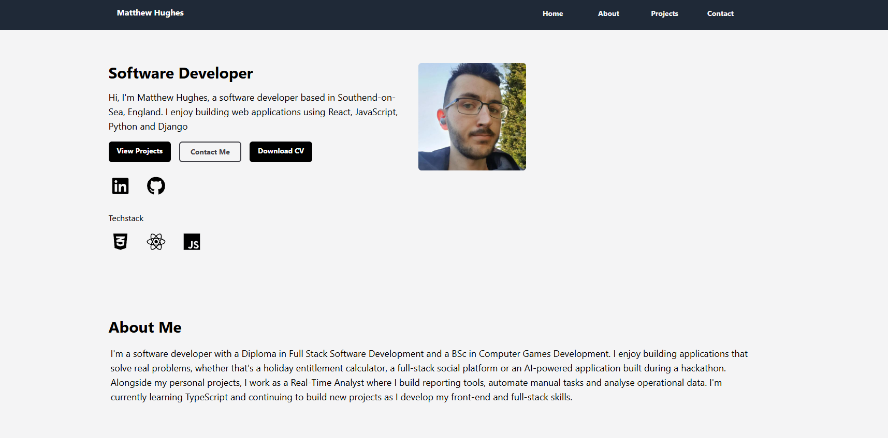

# Matthew Hughes Portfolio

This is my personal developer portfolio, built to showcase my projects, skills and experience as I continue developing as a software developer.

## Live Site

[View the live site](https://portfolio-app-sigma-five.vercel.app/)

## Preview

## About

The portfolio includes information about me, my technical skills, and selected projects I have built using React, JavaScript, Python, Django and other technologies.

It is designed to give recruiters and employers a clear overview of my work, with links to live projects and GitHub repositories.

## Features

- Responsive design for desktop and mobile
- Project showcase section
- Links to live demos and GitHub repositories
- About section
- Contact information
- Clean and simple UI

## Technologies Used

- React
- JavaScript
- HTML
- CSS
- Vercel

## Projects Featured

- Souls Like Gallery
- Holiday Entitlement Calculator
- Tech Buddy
- Last Trophy

## What I Learned

While building this portfolio, I improved my understanding of:

- Structuring a React application
- Creating reusable components
- Responsive layouts
- Deploying with Vercel
- Presenting projects clearly for recruiters and employers

## Future Improvements

- Add more detailed project case studies
- Add TypeScript
- Add animations or page transitions

## Contact

LinkedIn: https://www.linkedin.com/in/matthew-hughes-37a3291b8  
GitHub: https://github.com/mattthughes  
Portfolio: https://portfolio-app-sigma-five.vercel.app/
